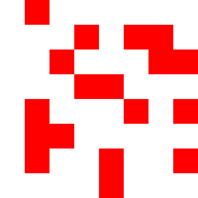
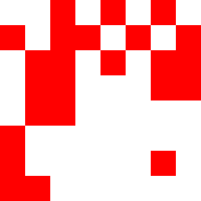

# Generative art system using Markov chains and quinary logic
Through the combination of Markov chains and quinary logic, this code exemplifies how algorithmic techniques can be applied to create visually captivating and dynamic generative art. The resulting artwork reflects the inherent complexity and richness that emerge from the interaction of simple rules and randomness.

